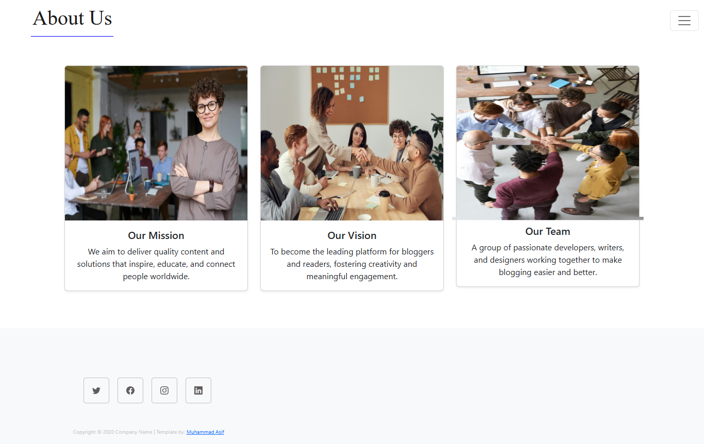
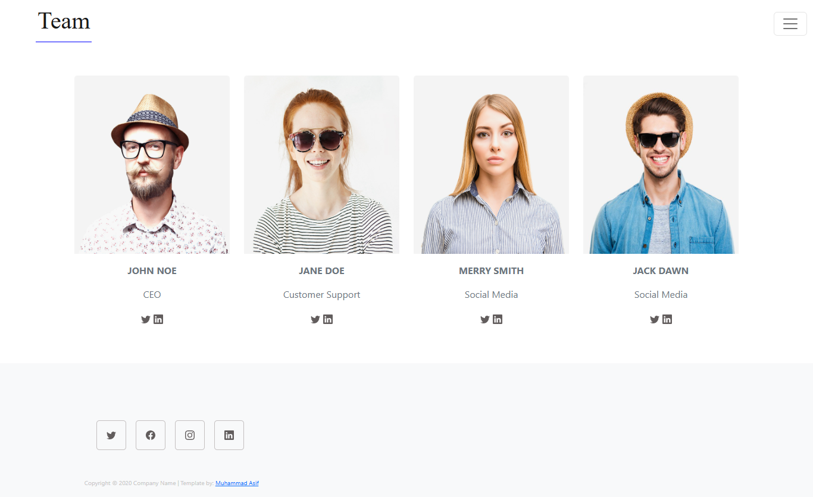
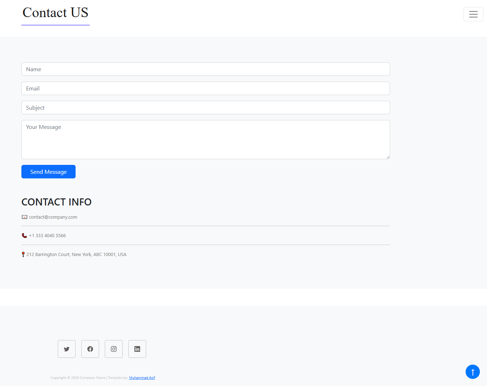

# Blog Website

A simple static blog website built with HTML, Bootstrap 5, and vanilla JavaScript. It features a home page with an auto-playing carousel, a blog page with dynamic cards rendered from a JavaScript array, client-side search, and additional pages for team, about, and contact (with a working toast).

## Features
- Auto-play, looping carousel on the home page
- Blog posts defined in `script.js` and rendered dynamically
- Client-side search (title/author) on `blog.html`
- Back-to-top button
- Contact form with validation and Bootstrap toast
- Clean URL routing for Render via `_redirects`

## Pages
- `index.html` — Landing page with hero carousel and latest posts
- `blog.html` — Dynamic blog grid and search bar (banner removed)
- `about.html`, `team.html`, `contact.html` — Supporting pages

## Screenshots
- Home (index):
  
- Blog (blog):
  
- About:
  
- Team:
  
- Contact:
  

## Local Development
Open `index.html` in your browser. No build step required.

If you use a local server (recommended for CORS and routing):
- VS Code Live Server or `npx serve .`

## Deployment on Render (Static Site)
- Root: project root (where `index.html` is)
- Build command: none
- Publish directory: `.`
- Include `_redirects` with:
  ```
  /about /about.html 200
  /blog /blog.html 200
  /team /team.html 200
  /contact /contact.html 200
  /* /index.html 200
  ```

## Structure
```
.
├── index.html
├── blog.html
├── about.html
├── team.html
├── contact.html
├── blogwebsite.css
├── script.js
├── _redirects
└── assets/
```

## How search works
- `script.js` contains a `posts` array with `title`, `author`, `date`, and `image` fields.
- On `blog.html`, the script renders the posts into a grid.
- The search bar filters posts client-side by title or author.

## Notes
- Feel free to edit the `posts` array in `script.js` to manage your content.
- Make sure screenshots exist at the paths you specify in this README.
